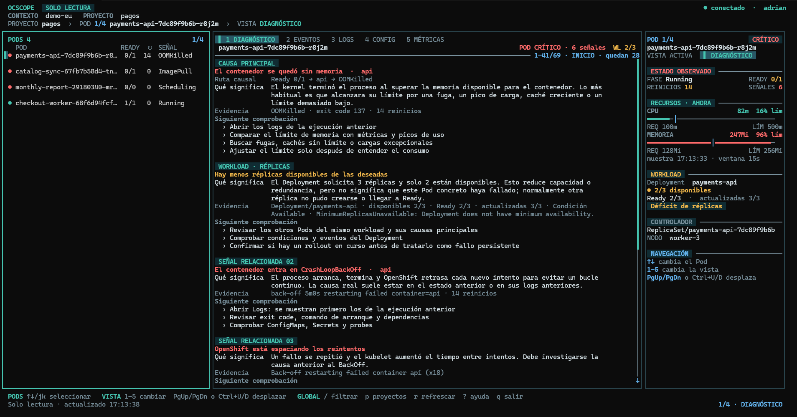
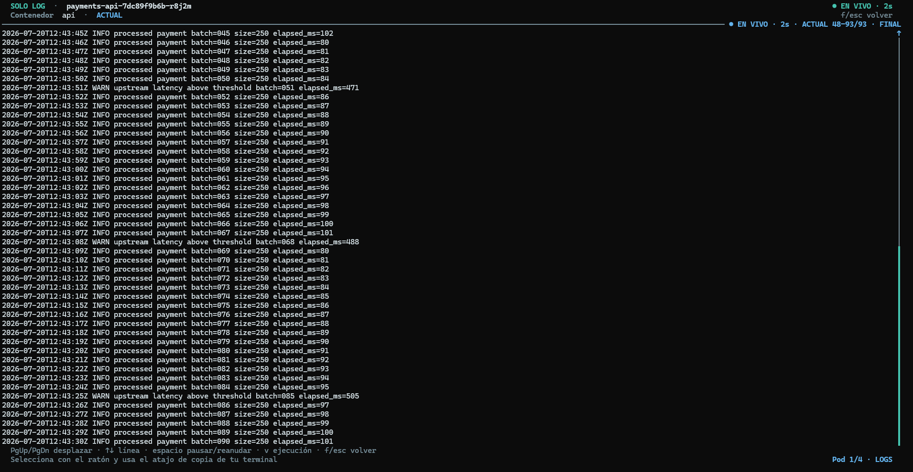
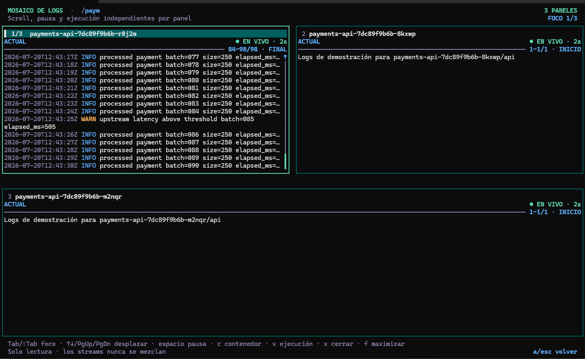
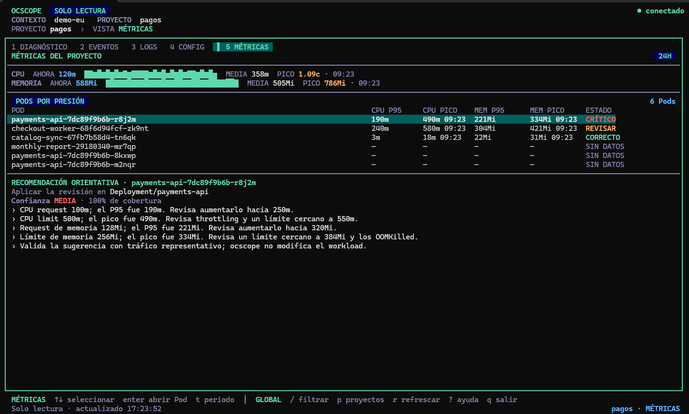

# ocscope



**ocscope** es una herramienta de terminal para observar y diagnosticar
aplicaciones desplegadas en OpenShift. Reúne el estado de los Pods, eventos,
diagnóstico, logs, métricas y estado del workload en una interfaz rápida y
legible.

> **Solo lectura:** ocscope no aplica cambios, borra recursos, escala
> workloads, reinicia Pods ni ejecuta comandos dentro de contenedores.

> [!NOTE]
> Esta página contiene únicamente binarios publicados. El código fuente del
> proyecto se mantiene en un repositorio separado.

## Capturas








<!-- [EDITAR] Puedes eliminar capturas o añadir un GIF corto de uso. -->

## Funcionalidades

- Lista de Pods ordenada para mostrar primero los estados problemáticos.
- Diagnóstico de causas habituales como `OOMKilled`, probes, imágenes,
  scheduling, volúmenes, red y `CrashLoopBackOff`.
- Estado del workload propietario y disponibilidad de réplicas.
- CPU y memoria actuales comparadas con requests y limits.
- Histórico de métricas cuando el clúster expone Prometheus/Thanos y tu cuenta
  tiene permisos suficientes.
- Logs de la ejecución actual y de la anterior, sin mezclarlos.
- Logs actuales mediante streaming persistente con reconexión automática y
  fallback a sondeo.
- Selector de contenedor, incluidos init containers.
- Modo `SOLO LOG` para leer y copiar logs con más espacio.
- Mosaico de 2 a 6 Pods filtrados, con foco, scroll, pausa y ejecución
  independientes por panel.
- Cambio de proyecto sin modificar el contexto persistente de `oc`.
- Interfaz disponible en español e inglés.

## Requisitos

- macOS o Windows.
- OpenShift CLI (`oc`) instalado y disponible en el `PATH`.
- Una sesión válida en el clúster:

  ```bash
  oc login --web
  oc whoami
  oc project -q
  ```

- Una terminal moderna con soporte UTF-8. En Windows se recomienda Windows
  Terminal.

No necesitas instalar Go para utilizar los binarios publicados.

## Descarga

Ve a la sección [Releases](https://github.com/adelylria/ocscope-releases/releases)
y descarga el paquete correspondiente a tu sistema:

| Sistema | Archivo recomendado |
|---|---|
| macOS Apple Silicon | `ocscope-VERSION-darwin-arm64.tar.gz` |
| macOS Intel | `ocscope-VERSION-darwin-amd64.tar.gz` |
| macOS Intel o Apple Silicon | `ocscope-VERSION-darwin-universal.tar.gz` |
| Windows x64 | `ocscope-VERSION-windows-amd64.zip` |
| Windows ARM | `ocscope-VERSION-windows-arm64.zip` |

Sustituye `VERSION` por la versión publicada, por ejemplo `0.15.0`.

## Instalación en macOS

1. Descarga el paquete `darwin-universal` recomendado para la mayoría de
   equipos actuales.
2. Descomprímelo:

   ```bash
   tar -xzf ocscope-VERSION-darwin-universal.tar.gz
   cd ocscope-VERSION-darwin-universal
   ```

3. Ejecuta las instrucciones incluidas en `INSTALL.txt` o instala el binario
   en una carpeta de tu `PATH`:

   ```bash
   mkdir -p "$HOME/.local/bin"
   install -m 755 ocscope "$HOME/.local/bin/ocscope"
   ```

4. Si utilizas `zsh` y esa carpeta no está en el `PATH`:

   ```bash
   echo 'export PATH="$HOME/.local/bin:$PATH"' >> "$HOME/.zshrc"
   export PATH="$HOME/.local/bin:$PATH"
   ```

5. Comprueba la instalación:

   ```bash
   ocscope --version
   ```

Los paquetes de macOS no están firmados ni notarizados. macOS puede pedirte
autorizar la primera ejecución desde **Ajustes del Sistema → Privacidad y
seguridad**.

## Instalación en Windows

1. Descarga el ZIP `windows-amd64` para la mayoría de equipos o
   `windows-arm64` para Windows on ARM.
2. Extrae el ZIP.
3. Abre PowerShell en la carpeta extraída y ejecuta:

   ```powershell
   powershell.exe -NoProfile -ExecutionPolicy Bypass -File .\install.ps1
   ```

El instalador coloca ocscope en `%LOCALAPPDATA%\Programs\ocscope` y añade esa
carpeta al `PATH` del usuario. Abre una terminal nueva y comprueba:

```powershell
ocscope --version
```

Los binarios de Windows no están firmados; SmartScreen puede mostrar una
advertencia. Continúa solo si reconoces el origen del paquete.

## Primer arranque

Con una sesión válida de `oc`, ejecuta:

```bash
ocscope
```

Si tienes acceso a varios proyectos, ocscope mostrará un selector al arrancar.
También puedes indicar uno directamente:

```bash
ocscope --project mi-proyecto
```

Para probar la interfaz sin conectarte a OpenShift:

```bash
ocscope --demo
```

## Actualizaciones

Las versiones publicadas comprueban si existe una actualización al arrancar.
Cuando hay una nueva versión, la aplicación muestra un aviso y el comando que
debes ejecutar:

```bash
ocscope --update
```

También puedes comprobarlo manualmente sin descargar nada:

```bash
ocscope --check-update
```

La descarga se verifica con `checksums.txt` antes de sustituir el ejecutable.
La sustitución es transaccional: si falla, se conserva la versión instalada.

Para desactivar la comprobación al arrancar:

```bash
ocscope --no-update-check
```

Los binarios de desarrollo no realizan autoactualizaciones.

## Atajos principales

| Tecla | Acción |
|---|---|
| `↑` / `↓`, `j` / `k` | Seleccionar Pod |
| `1`–`5`, `Tab` | Cambiar de vista |
| `c` | Seleccionar contenedor |
| `v` | Alternar ejecución anterior/actual |
| `f` | Abrir o cerrar `SOLO LOG`; en el mosaico, maximizar/restaurar |
| `a` | Abrir mosaico con los Pods filtrados |
| `Tab` / `Shift+Tab` | Cambiar el panel activo del mosaico |
| `Espacio` | Pausar o reanudar el log activo |
| `Page Up` / `Page Down` | Desplazar el log |
| `Ctrl+U` / `Ctrl+D` | Desplazamiento alternativo |
| `/` | Filtrar Pods |
| `p` | Cambiar de proyecto |
| `r` | Refrescar ahora |
| `?` | Mostrar ayuda |
| `q` | Salir |

En un MacBook, `fn`+`↑` y `fn`+`↓` equivalen a `Page Up` y `Page Down`.

## Integridad de las descargas

Cada release incluye un archivo `checksums.txt` con hashes SHA-256. Puedes
verificar un paquete desde macOS o Linux así:

```bash
grep 'ocscope-VERSION-darwin-universal.tar.gz' checksums.txt \
  | shasum -a 256 -c -
```

En PowerShell:

```powershell
Get-FileHash .\ocscope-VERSION-windows-amd64.zip -Algorithm SHA256
```

Compara el resultado con la línea correspondiente de `checksums.txt` publicada
en la misma release.

## Configuración opcional

ocscope utiliza por defecto la configuración activa de `oc`. También admite
estas opciones:

```bash
ocscope --project mi-proyecto
ocscope --context mi-contexto
ocscope --kubeconfig /ruta/a/kubeconfig
ocscope --language en
ocscope --refresh 5s
```

<!-- [EDITAR] Añade aquí variables de entorno o valores recomendados por tu equipo. -->

## Solución de problemas

### `ocscope` no encuentra `oc`

Comprueba que `oc` está instalado y disponible:

```bash
oc version --client
```

### No aparecen métricas históricas

Las métricas actuales y el histórico dependen de los permisos y de la
configuración de monitorización del clúster. La vista principal continúa
funcionando aunque Thanos o `metrics.k8s.io` no estén disponibles.

### No puedo actualizar el ejecutable

Comprueba que el usuario tiene permisos de escritura sobre la carpeta donde
está instalado ocscope. En Windows, cierra cualquier proceso que lo esté
utilizando y abre una terminal nueva después de actualizar.

### macOS o Windows muestran una advertencia de seguridad

Los binarios distribuidos todavía no están firmados. Verifica que el archivo
procede de la release oficial y valida su checksum antes de autorizarlo.

## Privacidad y seguridad

ocscope usa la sesión y el kubeconfig de `oc` para consultar el clúster. Los
tokens no se muestran ni se guardan en los paquetes de release. La aplicación
no imprime secretos, valores de variables ni contenidos de Secrets.

<!-- [EDITAR] Sustituye o amplía esta sección con tu política de privacidad. -->

## Licencia

<!-- [EDITAR] Indica aquí la licencia y el enlace al texto legal. -->

Este software se distribuye bajo los términos de **[NOMBRE DE LA LICENCIA]**.
Consulta [`LICENSE`](LICENSE) para más información.

## Contacto y soporte

<!-- [EDITAR] Sustituye estos enlaces por los canales oficiales. -->

- Problemas: [Issues](https://github.com/adelylria/ocscope-releases/issues)
- Releases: [Releases](https://github.com/adelylria/ocscope-releases/releases)
---

**Versión documentada:** `[VERSION]`  
**Última actualización:** `[FECHA]`
